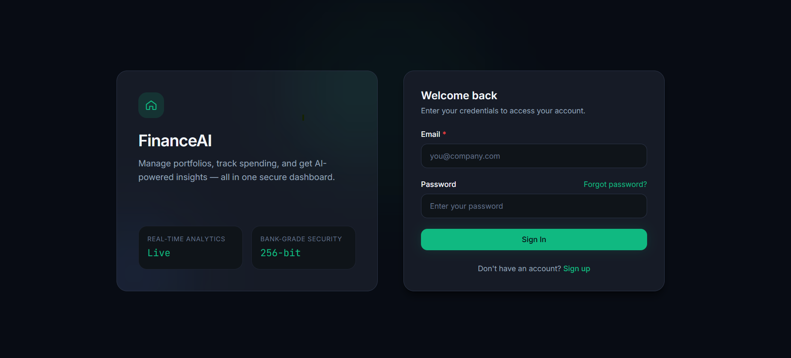
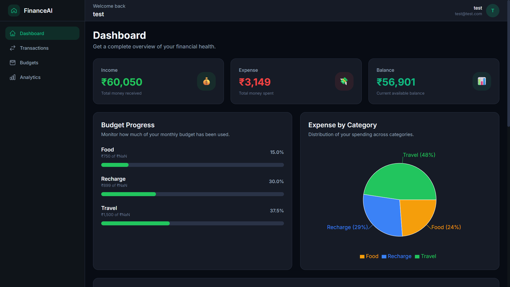
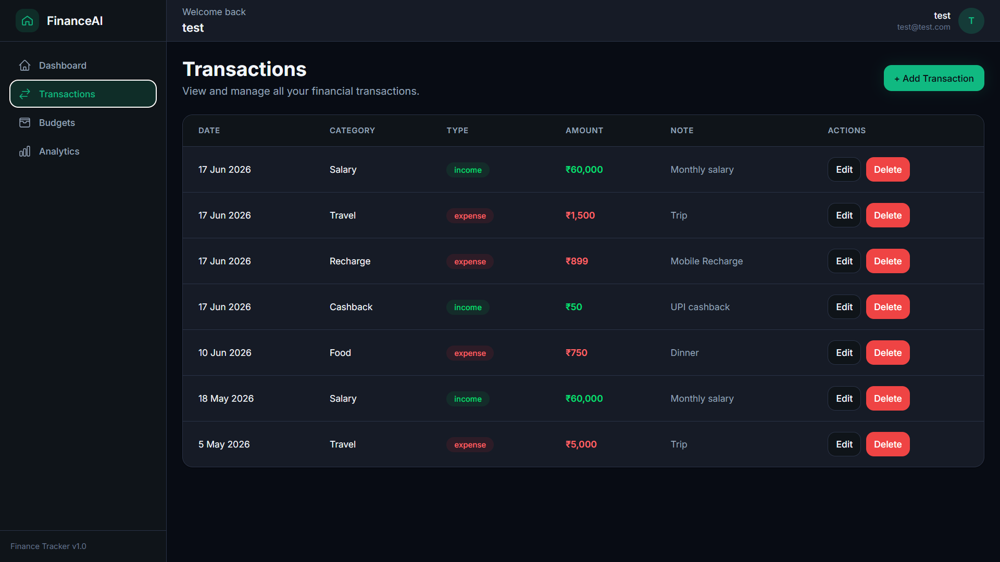
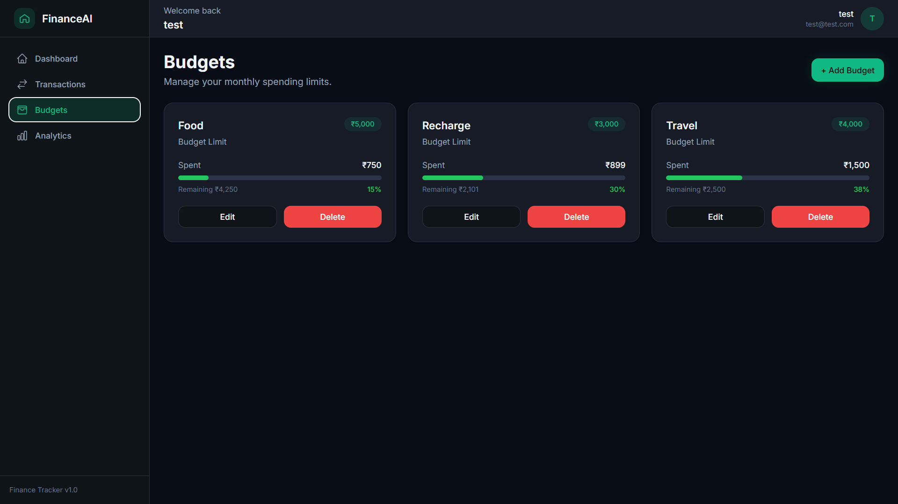
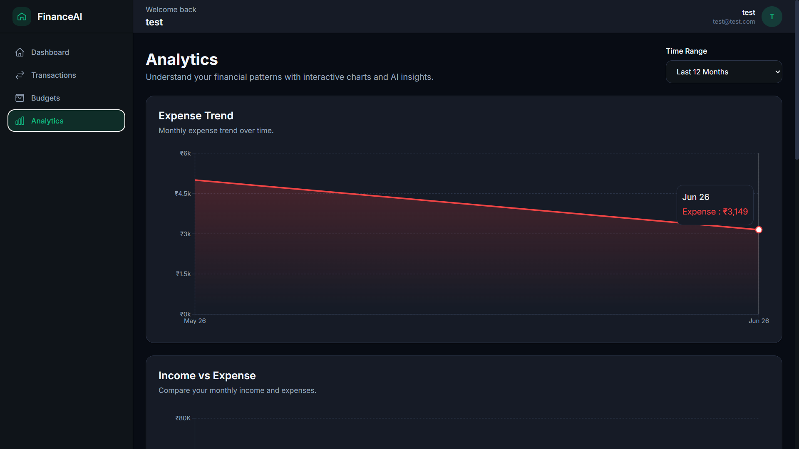

# 💰 Personal Finance Tracker

A full-stack **Personal Finance Management** application built with the **MERN Stack** that helps users manage income, expenses, monthly budgets, and financial analytics through an intuitive dashboard.

The application provides secure authentication, transaction management, budget planning, interactive charts, and insightful financial reports, making it easier for users to monitor their financial health.

---

## 🚀 Live Demo

> **Frontend:** Coming Soon

> **Backend API:** Coming Soon

*(These links will be updated after deployment.)*

---

# 📸 Screenshots

## 🔐 Login Page



---

## 📊 Dashboard



---

## 💸 Transactions



---

## 📅 Budget Management



---

## 📈 Analytics



---

# ✨ Features

## 🔐 Authentication

- User Registration
- User Login
- JWT Authentication
- Protected Routes
- Secure Password Hashing

---

## 💸 Transaction Management

- Add Transactions
- Edit Transactions
- Delete Transactions
- Income & Expense Tracking
- Category-wise Classification

---

## 📊 Dashboard

- Total Income
- Total Expenses
- Total Savings
- Recent Transactions
- Monthly Overview
- Category Breakdown

---

## 📅 Budget Management

- Create Monthly Budgets
- Update Budgets
- Delete Budgets
- Budget Utilization Tracking

---

## 📈 Analytics

- Monthly Expense Trends
- Income vs Expense Analysis
- Category-wise Expense Distribution
- Budget Utilization Charts

---

## 🎨 User Experience

- Responsive Design
- Loading States
- Error States
- Empty States
- Toast Notifications
- Confirmation Modals
- Reusable UI Components

---

# 🛠 Tech Stack

## Frontend

- React.js
- React Router DOM
- Tailwind CSS
- Axios
- React Toastify
- Recharts
- Lucide React

---

## Backend

- Node.js
- Express.js
- MongoDB
- Mongoose
- JWT Authentication
- bcrypt

---

## Development Tools

- Git
- GitHub
- VS Code
- Postman

---

# 📁 Project Structure

## Frontend

```text
frontend/
└── src/
    ├── api/
    ├── components/
    ├── config/
    ├── context/
    ├── layouts/
    ├── pages/
    ├── routes/
    ├── services/
    ├── utils/
    ├── App.jsx
    └── main.jsx
```

## Backend

```text
backend/
└── src/
    ├── config/
    ├── controllers/
    ├── middlewares/
    ├── models/
    ├── routes/
    ├── services/
    ├── utils/
    └── server.js
```

---

# ⚙️ Installation & Setup

## 1. Clone the Repository

```bash
git clone https://github.com/Aaditya970795/finance-app.git
```

---

## 2. Install Frontend Dependencies

```bash
cd frontend
npm install
```

---

## 3. Install Backend Dependencies

```bash
cd backend
npm install
```

---

## 4. Environment Variables

### Backend (`.env`)

```env
PORT=5000
MONGO_URI=your_mongodb_connection_string
JWT_SECRET=your_jwt_secret
```

### Frontend (`.env`)

```env
VITE_API_URL=http://localhost:5000/api
```

---

## 5. Run Backend

```bash
npm run dev
```

---

## 6. Run Frontend

```bash
npm run dev
```

---

# 🔌 API Overview

## Authentication

- POST `/api/auth/register`
- POST `/api/auth/login`

---

## Transactions

- GET `/api/transactions`
- POST `/api/transactions`
- PUT `/api/transactions/:id`
- DELETE `/api/transactions/:id`

---

## Budgets

- GET `/api/budgets`
- POST `/api/budgets`
- PUT `/api/budgets/:id`
- DELETE `/api/budgets/:id`

---

## Dashboard

- GET `/api/dashboard/summary`
- GET `/api/dashboard/category-breakdown`
- GET `/api/dashboard/monthly-overview`

---

## Analytics

- Monthly Trend
- Income vs Expense
- Category Breakdown
- Budget Utilization
- Financial Insights

---

# 🧠 What I Learned

Through this project, I gained practical experience with:

- Full-stack MERN application development
- REST API design and implementation
- JWT Authentication & Authorization
- MongoDB & Mongoose
- React Context API
- Component-based architecture
- Reusable UI component design
- CRUD operations
- Dashboard & Analytics development
- Error handling
- Loading and Empty states
- Responsive UI development
- Project organization and folder structure

---

# 🚀 Future Improvements

- Export Reports as PDF
- CSV Export
- AI-powered Financial Insights
- Recurring Transactions
- Dark Mode
- Email Notifications
- Multi-Currency Support

---

# 👨‍💻 Author

**Aaditya**

GitHub:
https://github.com/Aaditya970795

LinkedIn:
(Add your LinkedIn profile here)

---

# 📄 License

This project is licensed under the MIT License.